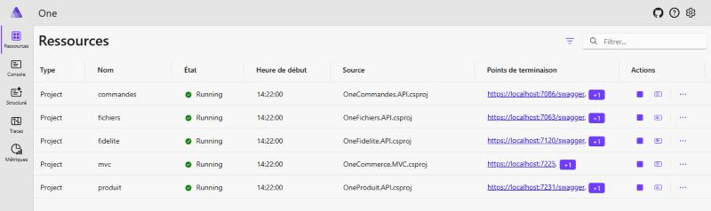
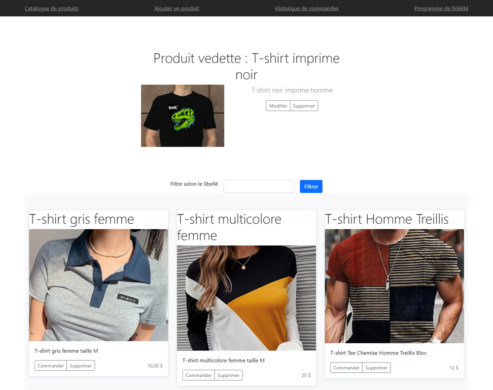
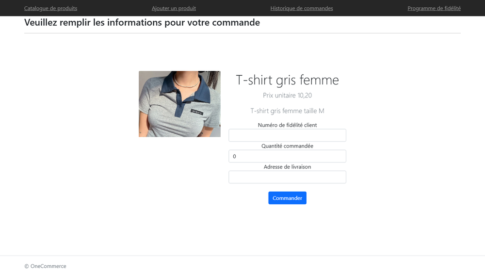
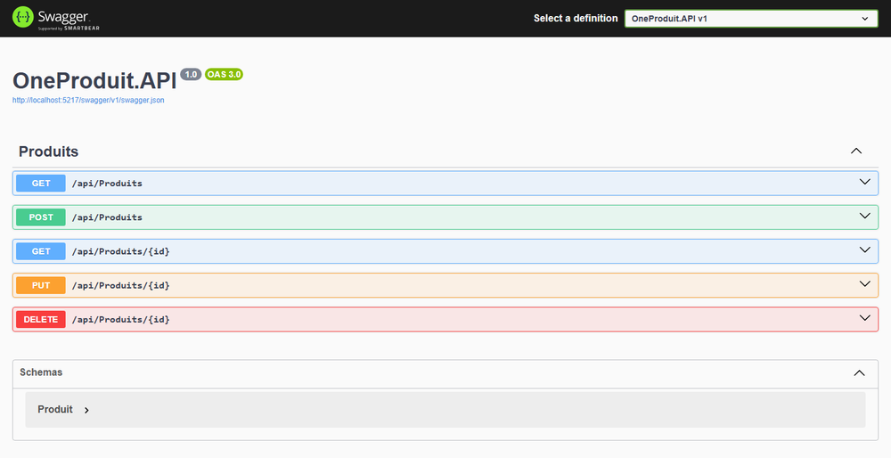

# onecommerce-microservices

[](https://github.com/Arthure-code/onecommerce-microservices/actions/workflows/build.yml)
[](https://sonarcloud.io/summary/new_code?id=Arthure-code_onecommerce-microservices)
[](https://sonarcloud.io/summary/new_code?id=Arthure-code_onecommerce-microservices)
[](https://sonarcloud.io/summary/new_code?id=Arthure-code_onecommerce-microservices)
[](https://sonarcloud.io/summary/new_code?id=Arthure-code_onecommerce-microservices)
[](https://sonarcloud.io/summary/new_code?id=Arthure-code_onecommerce-microservices)
[](https://sonarcloud.io/summary/new_code?id=Arthure-code_onecommerce-microservices)

A shop split into five services: a catalogue, a file store for its images, orders, loyalty cards, and the site people actually visit. One command starts all five and the dashboard that watches them.

.NET 8, ASP.NET Core MVC and Web API, .NET Aspire, Bicep, Azure DevOps.

## Screenshots

**Five services, one command**



**The shop**



**Placing an order**



**The catalogue API**



## How it works

**The services find each other by name.** The shop asks for `http://produit`, not for a host and a port. The host resolves the name, so the same setting holds on a laptop and in Azure, and a service can be moved or restarted without anyone editing an address.

**A price with cents used to be rejected on the server.** The catalogue validated its prices with a regular expression that only accepted a comma as the decimal mark. That expression is rendered with the culture of the machine running it, so `30,50` passed in Québec and failed the moment the service ran under any other culture, which is what an App Service does by default. The service's own catalogue was invalid on the very host it was written for. A range check replaced it, and a test pins the behaviour under three cultures.

**Images go straight to storage, and never through the API.** The file service used to write into its own wwwroot on the App Service disk, which is wiped on restart and shared with neither the staging slot nor a second instance, while the private container the template creates sat unused. Worse, the address the shop built its image tags from was pinned to `https://localhost:7063`, so a deployed catalogue showed nothing at all. The browser now asks where to write, receives a URL signed for fifteen minutes, writes the image itself, and sends back only the name.

**Reading costs one signature, not one per image.** A container read signature is issued for half an hour and cached, so a page of twenty products is one signature rather than twenty. The container stays private.

**The store refuses to be talked out of its own folder.** A name like `../../appsettings.json` used to write wherever it pleased. The proposed name is now reduced to its last segment, compared with what was sent, checked against the characters a file name may hold, and matched against the three image extensions the store serves. The name actually written is drawn server side and keeps only the extension, so two visitors who both upload `photo.png` do not overwrite each other. Twelve tests hold the door shut.

**Nothing signs with an account key.** The file service asks the storage account for a delegation key using the App Service's own identity, which the template grants the blob data role on that one container. Deploying therefore needs rights to create a role assignment; without them that one resource fails and the rest of the stack still deploys.

**The buttons do what they say.** Modifier and Supprimer sat under the products and led nowhere: the catalogue API had no `PUT` and no `DELETE`, and the shop had no code behind either form. Both now exist, and a modification that arrives without a new image keeps the one the product already had, rather than blanking it.

**An order leaves on a queue.** The order service gives it a number, a date and a total, posts it to the Service Bus queue, and only then returns it. If the broker refuses, the caller is told; the order does not come back as a quiet success.

**The infrastructure is two stacks, and the linter is turned up.** `bicepconfig.json` turns unused parameters, hand-built resource identifiers, missing parent properties and string concatenation where interpolation belongs into errors. Raising the stale API versions it flagged is what exposed the elastic pool and its databases still being described in the shape of 2014, with `edition` and `dtu` where `sku` belongs. The chain compiles both stacks before it analyses anything, so a diagnostic stops the build rather than reaching a report.

**The deployment finds the applications instead of being told their names.** Each application carries four characters derived from its resource group, so the names only exist once the infrastructure has run. The deploy stages look them up by prefix and stop with a readable message when the infrastructure pipeline has not run yet. Pinning them, as they were, meant every stage failed in any subscription but the one they were written in.

## Running it

Everything starts from the host. The dashboard address, with its one-time token, is printed in the console.

```bash
dotnet run --project One.AppHost
```

The shop answers on `https://localhost:7225`, and each API carries its own Swagger page.

Orders are accepted and logged until a broker is configured. To post them for real, give the order service a connection string rather than writing one into the repository.

```bash
dotnet user-secrets --project src/OneCommandes.API set ConnectionStrings:SvCConnectionString "the connection string"
```

```bash
dotnet test
```

```bash
az bicep build --file BicepOneCommerce/main.bicep
```

## Résumé

Une boutique découpée en cinq services : le catalogue, le magasin de fichiers qui sert ses images, les commandes, les cartes de fidélité, et le site que les gens visitent. Une seule commande démarre les cinq et le tableau de bord qui les surveille.

Les services se trouvent par leur nom plutôt que par une adresse et un port, donc le même réglage tient sur un poste et dans Azure.

Le catalogue validait ses prix avec une expression régulière qui n'acceptait que la virgule comme séparateur décimal. Cette expression est rendue avec la culture de la machine : `30,50` passait au Québec et échouait dès que le service tournait sous une autre culture, ce qui est le cas d'un App Service par défaut. Le catalogue du service était invalide sur l'hôte même pour lequel il était écrit. Une borne a remplacé l'expression, et un test fixe le comportement sous trois cultures.

Le service de fichiers ne touchait jamais le compte de stockage que l'infrastructure crée. Il écrivait dans son propre wwwroot, sur un disque effacé au redémarrage, pendant que le conteneur privé restait inutilisé. Pire, l'adresse d'où la boutique construisait ses balises d'image était figée à `https://localhost:7063` : déployé, le catalogue n'affichait rien du tout. Le navigateur demande maintenant où écrire, reçoit une URL signée pour quinze minutes, y dépose l'image lui-même et ne renvoie que le nom. La lecture coûte une signature par demi-heure, mise en cache, et non une par image.

Le nom proposé est réduit à son dernier segment, comparé à ce qui a été envoyé, vérifié caractère par caractère et confronté aux trois extensions servies. Le nom réellement écrit est tiré côté serveur et ne garde que l'extension, donc deux visiteurs qui envoient `photo.png` ne s'écrasent pas. Rien n'est signé avec une clé de compte : le service demande une clé de délégation avec l'identité de l'App Service, à qui le gabarit donne le rôle sur ce seul conteneur.

Les boutons Modifier et Supprimer ne menaient nulle part : l'API n'avait ni `PUT` ni `DELETE`, et la boutique n'avait aucun code derrière les deux formulaires. Les deux existent, et une modification sans nouvelle image garde celle que le produit portait déjà.

Côté infrastructure, le linter Bicep est relevé au niveau erreur. C'est en montant les versions d'API périmées qu'il signalait qu'est apparu le pool élastique et ses bases encore décrits dans la forme de 2014. Les étapes de déploiement, elles, retrouvent les applications par leur préfixe au lieu de porter des noms figés, qui ne valaient que pour l'abonnement où ils avaient été écrits.

## Licence

MIT. See [LICENSE](LICENSE).
